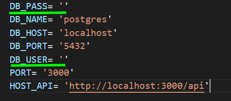
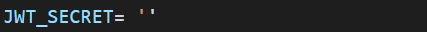
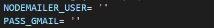

## Tecnologías usadas

| **Nest** | **TypeORM** | **Docker** |
|-|-|-|
| <a target="_BLANK" href="https://docs.nestjs.com/"></a> | <a target="_BLANK" href="https://typeorm.io/"></a> | <a target="_BLANK" href="https://www.docker.com/"></a> |

# Workii API

1. Clonar proyecto
2. ```npm install```
3. Renombrar el archivo ```.env.template``` con el nombre de ```.env```
4. Cambiar las variables de entorno.

>En las variables `DB_PASS` debes de colocar la contraseña de tu base de datos de postgress, y en la variable `DB_USER` debes colocar la respectiva contraseña de tu base de datos.



>En la variable `JWT_SECRET` debes colocar cualquier contraseña.



>En la variable `NODEMAILER_USER` debes colocar el correo con el que enviaras el token para que los usuarios se puedan registrar en la app, ya que los usuarios se registran con un código OTP para verificar que el correo exista, ademas debes de colocar la contraseña que google te da (Si es que lo haces con gmail) para poder darle acceso a aplicaciones de terceros en la variable correspondiente `PASS_GMAIL`.

***Nota:** Recuerda que la contraseña de gmail no es directamente la contraseña que creas. Es una contraseña que google te da especificamente para darle acceso a aplicaciones de terceros.*

>Google a partir de 30 de mayo del 2022 cambio sus politicas para compartir datos con terceros, acá te dejo un tutorial de como puedes hacer esto para ver la nueva forma de compartir estos datos (Ver desde el minuto 2:17 hasta el minuto 6:19) :

<div style ='text-align:center;'>
<a href="https://youtu.be/RpSQQIGTpTM" target="_BLANK" title="Link Title"></a>
</div>



1. Levantar la base de datos
```
docker-compose up -d
```
1. Ejecutar el modo de desarrollo ```npm run start:dev```
   
2. Cuando ejecutes el backend podrás ver la documentación de los endpoints en el siguiente link: `http://localhost:3000/api`